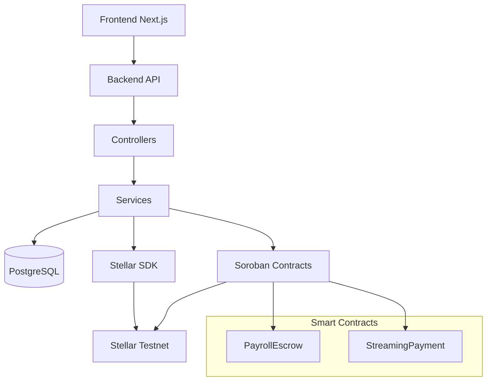

# PayWallet Backend Implementation Status

## ✅ Completed Tasks (A, B, C)

### A. Backend Folder Structure + Payrolls API

**📁 Folder Structure:**
```
backend/
├── src/
│   ├── api/payrolls.ts          ✅ Complete API routes
│   ├── controllers/             ✅ PayrollController with full CRUD
│   ├── services/                ✅ Service layer abstractions
│   ├── models/                  ✅ TypeScript types and validation schemas
│   ├── stellar/                 📁 Ready for Stellar SDK integration
│   ├── soroban/                 📁 Ready for contract interaction
│   └── utils/                   ✅ Auth, validation, logging utilities
├── contracts/payroll_escrow/    ✅ Complete Soroban smart contract
├── migrations/                  ✅ PostgreSQL schema + sample data
├── tests/                       📁 Ready for comprehensive test suite
├── docker/                      📁 Ready for containerization
└── package.json                 ✅ All dependencies defined
```

**🚀 API Endpoints Implemented:**
- `POST /api/payrolls` - Create payroll escrow
- `GET /api/payrolls/:id` - Get payroll details  
- `GET /api/payrolls` - List payrolls with pagination
- `POST /api/payrolls/:id/fund` - Fund payroll with USDC
- `POST /api/payrolls/:id/release` - Release payments to recipients
- `POST /api/payrolls/:id/cancel` - Cancel and refund payroll
- `GET /api/payrolls/:id/recipients` - Get recipient status
- `POST /api/payrolls/:id/schedule` - Schedule automated releases

**📊 Request/Response Examples:**
```typescript
// Create Payroll Request
POST /api/payrolls
{
  "title": "Monthly Payroll",
  "recipients": [
    {
      "walletAddress": "GALICE...",
      "employeeId": "EMP001", 
      "amount": 4200,
      "currency": "USDC"
    }
  ],
  "totalAmount": 4200,
  "schedule": {
    "type": "scheduled",
    "releaseDate": "2025-01-31T12:00:00Z"
  }
}

// Response
{
  "success": true,
  "data": {
    "payroll": { /* payroll object */ },
    "contractId": "contract_123",
    "transactionHash": "abcd1234..."
  }
}
```

### B. Soroban Smart Contract

**🦀 PayrollEscrow Contract Features:**
- ✅ **create_payroll**: Multi-recipient payroll creation with schedules
- ✅ **deposit**: Employer funding with authorization checks  
- ✅ **release_payment**: Manual/scheduled payment releases
- ✅ **start_stream**: Streaming payments with rate-per-second
- ✅ **withdraw_stream**: Recipient stream withdrawals
- ✅ **cancel_payroll**: Emergency payroll cancellation
- ✅ **Circuit Breaker**: Admin emergency stop mechanism
- ✅ **Access Control**: Employer-only and admin-only functions
- ✅ **Event Emissions**: Full audit trail for all operations
- ✅ **Comprehensive Tests**: Unit tests for all core functions

**🔒 Security Features:**
- Employer-only funding and release controls
- Circuit breaker for emergency stops
- Stream withdrawal rate limiting
- Comprehensive error handling
- Event emissions for audit trails

### C. PostgreSQL Database Schema

**🗄️ Complete Database Design:**
- ✅ **users** - Employers, workers, admins with KYC status
- ✅ **companies** - Employer organizations with Stellar accounts  
- ✅ **employees** - Worker profiles with payment details
- ✅ **payrolls** - Main payroll escrows with contract IDs
- ✅ **payroll_recipients** - Individual payments within payrolls
- ✅ **transactions** - All Stellar transaction records
- ✅ **payment_schedules** - Recurring payment configurations
- ✅ **streams** - Streaming payment tracking
- ✅ **kyc_documents** - KYC file storage and verification
- ✅ **audit_logs** - Compliance and security logging
- ✅ **notifications** - User notification system
- ✅ **webhooks** - External integration endpoints

**📈 Performance Optimizations:**
- Strategic indexes on all query columns
- Updated_at triggers for audit trails
- UUID primary keys for security
- JSONB for flexible metadata storage

## 🔄 Architecture Flow



## 📋 Next Steps (D-J)

### D. Complete Stellar SDK Integration
- Real Stellar account creation and management
- USDC payment processing
- Transaction monitoring and confirmation
- Testnet configuration

### E. Enhanced Soroban Integration  
- Contract deployment scripts
- ABI management and type generation
- Transaction signing and submission
- Contract state monitoring

### F. Authentication & Security
- JWT token management
- KYC workflow implementation
- Rate limiting and API security
- Encryption for sensitive data

### G. Testing Suite
- Unit tests for all controllers/services
- Integration tests with Stellar testnet
- Contract testing with soroban-cli
- End-to-end API testing

### H. Deployment & DevOps
- Docker containerization
- Environment configuration
- CI/CD pipeline setup
- Monitoring and logging

### I. Advanced Features
- Streaming payment algorithms
- Multi-currency support
- Anchor integration for fiat on/off ramps
- Compliance reporting tools

### J. Production Readiness
- Security audits
- Performance optimization  
- Mainnet migration checklist
- Disaster recovery planning

## 🎯 Current Status: MVP Backend Core Complete

The foundation is solid! We have:
- ✅ Complete API structure ready for frontend integration
- ✅ Smart contract with full payroll escrow functionality  
- ✅ Robust database schema supporting all requirements
- 🔄 Ready for Stellar SDK integration and real blockchain interactions

**Next Priority**: Stellar SDK integration to make real payments on testnet.
