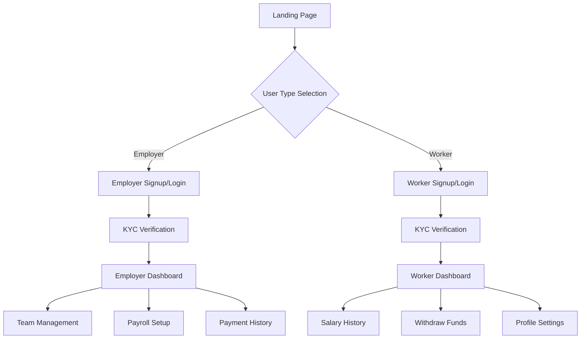

# PayWallet Stellar - Frontend

A Next.js frontend application for blockchain-based payroll and remittance using Stellar network.

## 🎯 **Overview**

PayWallet Stellar enables employers to pay salaries instantly & globally using Stellar blockchain technology. This frontend provides a complete user experience for both employers and workers/freelancers.

## 🚀 **Features**

### For Employers
- **Dashboard**: Real-time payroll overview and analytics
- **Employee Management**: Add, edit, and manage team members
- **Payment Scheduling**: Automated and one-time salary payments
- **Analytics**: Comprehensive payment history and reporting
- **Bulk Payments**: Process multiple salaries simultaneously

### For Workers
- **Earnings Dashboard**: Track salary history and total earnings
- **Instant Withdrawals**: Multiple withdrawal options (bank, crypto)
- **Transaction History**: Complete payment records
- **Multi-currency Support**: Receive payments in various currencies

## 🏗️ **Architecture**

### User Flow Diagram



## 📁 **Project Structure**

```
frontend/
├── src/
│   ├── app/                    # Next.js App Router
│   │   ├── (auth)/            # Authentication routes
│   │   │   ├── login/         # Login page
│   │   │   ├── signup/        # Registration page
│   │   │   └── layout.tsx     # Auth layout
│   │   ├── (dashboard)/       # Protected dashboard routes
│   │   │   ├── employer/      # Employer dashboard
│   │   │   ├── worker/        # Worker dashboard
│   │   │   └── layout.tsx     # Dashboard layout
│   │   ├── globals.css        # Global styles
│   │   ├── layout.tsx         # Root layout
│   │   └── page.tsx           # Landing page
│   ├── components/            # Reusable UI components
│   │   ├── ui/                # Base UI components
│   │   │   ├── button.tsx     # Button component
│   │   │   ├── card.tsx       # Card component
│   │   │   ├── input.tsx      # Input component
│   │   │   ├── table.tsx      # Table component
│   │   │   ├── modal.tsx      # Modal component
│   │   │   ├── badge.tsx      # Badge component
│   │   │   └── form.tsx       # Form components
│   │   └── layout/            # Layout components
│   │       └── DashboardLayout.tsx
│   ├── hooks/                 # Custom React hooks
│   │   └── index.ts           # API hooks
│   ├── lib/                   # Utility libraries
│   │   ├── api.ts             # API client
│   │   └── utils.ts           # Utility functions
│   ├── store/                 # State management (Zustand)
│   │   └── index.ts           # Global stores
│   └── types/                 # TypeScript definitions
│       └── index.ts           # Type definitions
├── public/                    # Static assets
├── package.json               # Dependencies
├── tailwind.config.js         # Tailwind configuration
├── tsconfig.json              # TypeScript configuration
└── README.md                  # This file
```

## 🔧 **Technology Stack**

- **Framework**: Next.js 15 (App Router)
- **Language**: TypeScript
- **Styling**: Tailwind CSS
- **State Management**: Zustand
- **Data Fetching**: TanStack Query (React Query)
- **UI Components**: Custom components with Tailwind
- **Icons**: Lucide React
- **Form Handling**: React Hook Form

## 🚀 **Getting Started**

### Prerequisites
- Node.js 18+ 
- npm or yarn

### Installation

```bash
# Navigate to frontend directory
cd frontend

# Install dependencies
npm install --legacy-peer-deps

# Start development server
npm run dev
```

### Development Scripts

```bash
npm run dev     # Start development server
npm run build   # Build for production
npm run start   # Start production server
npm run lint    # Run ESLint
```

## 🎯 **Key Frontend Features Summary**

✅ **Complete User Flows** - Employer & Worker journeys mapped  
✅ **Responsive Design** - Mobile-first approach  
✅ **API-Ready Components** - Backend integration prepared  
✅ **State Management** - Zustand for global state  
✅ **Type Safety** - Full TypeScript implementation  
✅ **Modern UI** - Clean, professional design  
✅ **Role-Based Access** - Employer/Worker specific features  
✅ **Demo Ready** - Mock data for testing  

The frontend is now **backend-connectable** and ready for integration with the Stellar blockchain backend!
